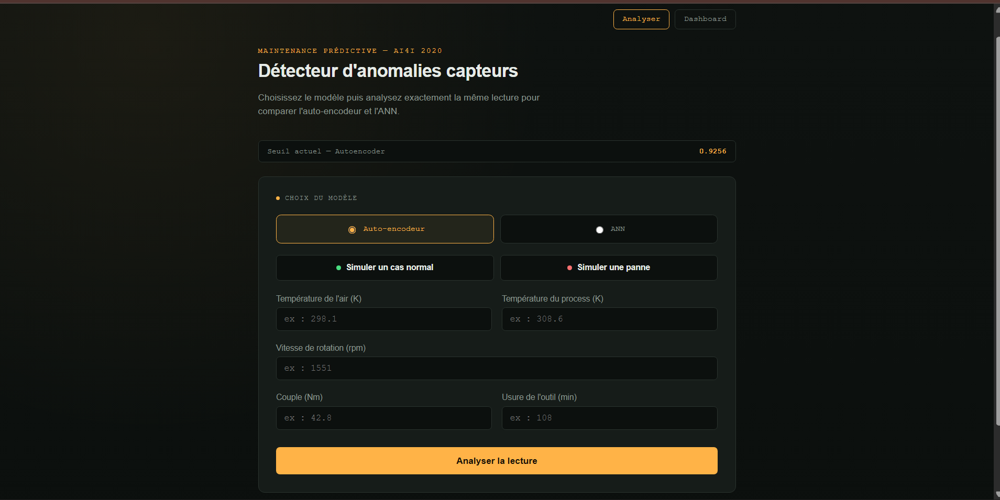
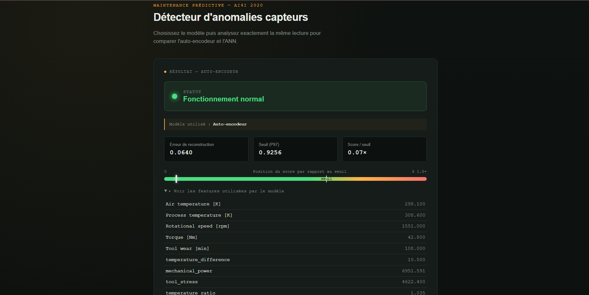
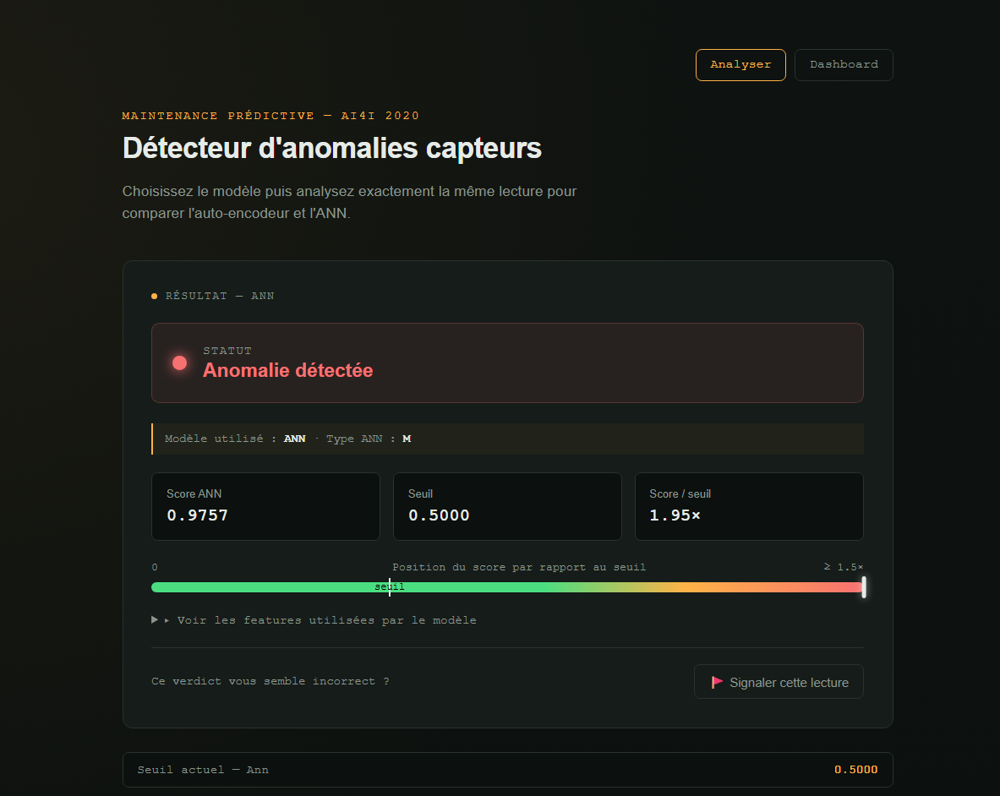
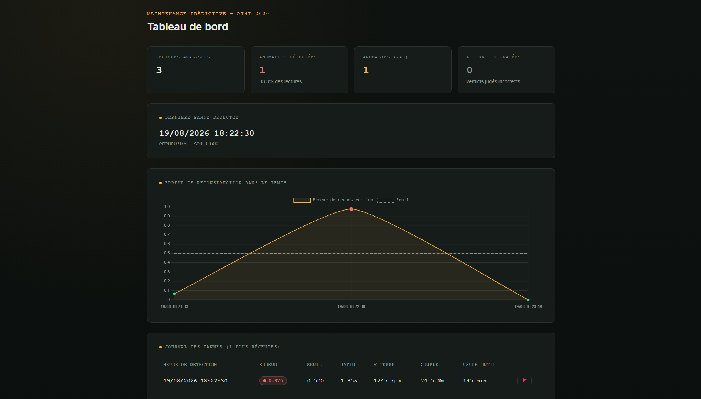

# AI2020 — Anomaly Detection

Application web de **maintenance prédictive** développée avec Django permettant
d'analyser des données de capteurs industriels et de détecter des anomalies.

Le projet compare deux approches de Machine Learning :

- un **Auto-encodeur** pour la détection d'anomalies ;
- un **réseau de neurones artificiels (ANN)** pour la classification des pannes.

---

## 🎯 Objectif du projet

L'objectif est de développer une application capable d'identifier automatiquement
des situations potentiellement anormales à partir de mesures provenant de
machines industrielles.

L'application permet également de comparer les résultats obtenus avec deux
approches différentes de Machine Learning.

---

## 📊 Dataset

Le projet utilise le dataset **AI4I 2020 Predictive Maintenance Dataset**.

Les principales variables utilisées sont :

- Air temperature [K]
- Process temperature [K]
- Rotational speed [rpm]
- Torque [Nm]
- Tool wear [min]

Des variables dérivées sont également calculées :

- Temperature difference
- Mechanical power
- Tool stress
- Temperature ratio
- Torque/speed ratio

---

## 🤖 Modèles utilisés

### 1. Auto-encodeur

L'auto-encodeur est utilisé pour effectuer une détection d'anomalies.

Le principe consiste à :

1. normaliser les données ;
2. reconstruire les observations avec l'auto-encodeur ;
3. calculer l'erreur de reconstruction ;
4. comparer cette erreur à un seuil.

Une observation est considérée comme anormale lorsque :

```text
Erreur de reconstruction > Seuil
```

Le seuil utilisé dans l'application est basé sur le **97e percentile (P97)**.

---

### 2. Artificial Neural Network (ANN)

Un réseau de neurones artificiels est également utilisé pour effectuer une
classification supervisée.

L'ANN produit un score permettant de déterminer si une observation correspond
à une situation normale ou à une panne.

La règle de décision utilisée est :

```text
Score >= 0.5 → Panne
Score < 0.5  → Normal
```

---

## 🔄 Architecture du projet

```text
                 Données capteurs
                        │
                        ▼
                Feature Engineering
                        │
                        ▼
              ┌─────────┴─────────┐
              │                   │
              ▼                   ▼
        Auto-encodeur             ANN
              │                   │
              ▼                   ▼
      Erreur de reconstruction    Score
              │                   │
              ▼                   ▼
           Seuil P97            Seuil 0.5
              │                   │
              └─────────┬─────────┘
                        ▼
                     Résultat
                        │
                        ▼
                 Interface Django
```

---

## 🖥️ Fonctionnalités

L'application permet de :

- saisir des mesures de capteurs ;
- simuler un cas normal ;
- simuler une panne ;
- sélectionner le modèle à utiliser ;
- analyser une observation ;
- afficher le score du modèle ;
- afficher le seuil de décision ;
- afficher le verdict Normal / Anomalie ;
- consulter les features utilisées ;
- conserver un historique des analyses ;
- consulter un dashboard ;
- comparer l'Auto-encodeur et l'ANN.
- **🚩 Signaler** pour marquer un verdict jugé incorrect par un opérateur (faux positif/négatif)
- **bouton de réinitialisation** (supprime tout l'historique, avec confirmation)

---

## 🔀 Comparaison des modèles

L'interface permet d'utiliser le **même jeu de valeurs** avec les deux modèles.

```text
Même observation
       │
       ├──► Auto-encodeur ──► Score + seuil ──► Verdict
       │
       └──► ANN ────────────► Score + seuil ──► Verdict
```

Cela permet d'étudier les différences entre une approche de détection
d'anomalies non supervisée et une approche de classification supervisée.

---

## 🛠️ Technologies utilisées

### Backend

- Python
- Django

### Machine Learning

- TensorFlow / Keras
- Scikit-learn
- Pandas
- NumPy
- Joblib

### Frontend

- HTML
- CSS
- JavaScript

### Base de données

- SQLite

---

## 📁 Structure du projet

```text
AI2020/
│
├── config/
├── notebook/
│   ├── AI2020_AUTOENCODER_ANN.ipynb
├── screeshots/
│   ├── anomalie.png
│   ├── normal.png
│   ├── dashboard.png
│   ├── interface.png
├── detector/
│   ├── migrations/
│   ├── ml_artifacts/
│   │   ├── autoencoder.keras
│   │   ├── scaler.pkl
│   │   ├── threshold.pkl
│   │   ├── ann_model.keras
│   │   ├── scaler_ann.pkl
│   │   └── ann_threshold.pkl
│   │
│   ├── static/
│   ├── templates/
│   ├── forms.py
│   ├── ml_model.py
│   ├── models.py
│   ├── urls.py
│   └── views.py
│
├── manage.py
├── requirements.txt
├── README.md
└── .gitignore
```

---

## 🚀 Installation

### 1. Cloner le repository

```bash
git clone https://github.com/nafy-dieye/AI2020-Anomaly-Detection.git
```

### 2. Entrer dans le projet

```bash
cd AI2020-Anomaly-Detection
```

### 3. Créer un environnement virtuel

```bash
python -m venv venv
```

### 4. Activer l'environnement virtuel

Sous Windows :

```bash
venv\Scripts\activate
```

### 5. Installer les dépendances

```bash
pip install -r requirements.txt
```

### 6. Appliquer les migrations

```bash
python manage.py migrate
```

### 7. Lancer le serveur

```bash
python manage.py runserver
```

L'application sera accessible à :

```text
http://127.0.0.1:8000/
```

---

## 📈 Exemple de résultat

### ANN

```text
Modèle utilisé : ANN

Score ANN : 0.9787
Seuil      : 0.5000
Score/seuil: 1.96x

→ Anomalie détectée
```

### Auto-encodeur

```text
Modèle utilisé : Auto-encodeur

Erreur de reconstruction : 0.45
Seuil P97                 : 0.92

→ Fontionnement Normal
```

---

## 📸 Captures d'écran


-  ;
-  ;
-  ;
- .


---

## 🎓 Contexte

Projet réalisé dans le cadre de mon apprentissage en **Big Data / Intelligence
Artificielle** plus precisement le Deep Learning , avec pour objectif de mettre en pratique :

- l'analyse de données ;
- le feature engineering ;
- le Machine Learning ;
- le Deep Learning ;
- la détection d'anomalies ;
- la classification ;
- l'intégration d'un modèle ML dans une application Django.

---

## 👩🏽‍💻 Auteur

**Nafy Dieye** et **Ndeye Yandé Ndiaye**

Big Data & Intelligence Artificielle
